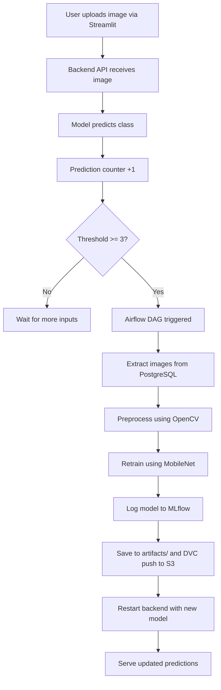
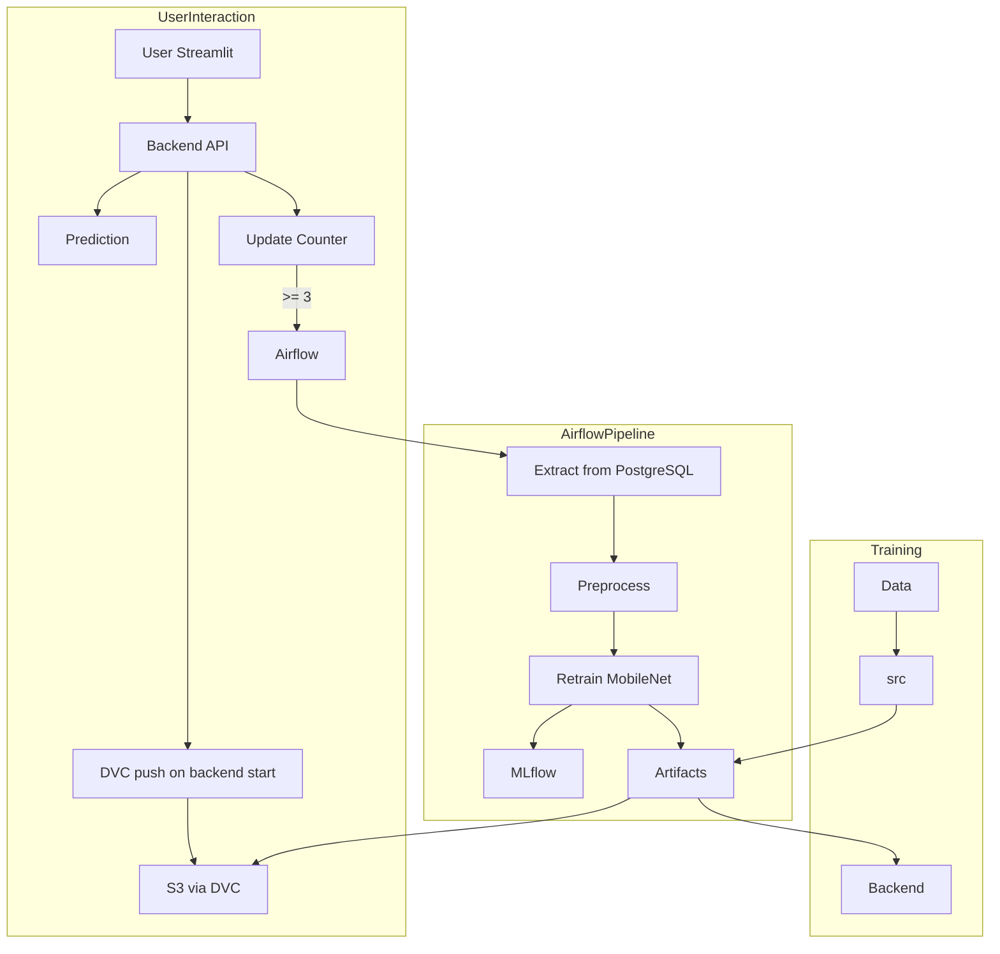

# 🧠📸 Rock-Paper-Scissors: Real-Time MLOps Pipeline with OpenCV, Airflow & Transfer Learning

Welcome to the **Rock-Paper-Scissors (RPS) MLOps System** — a cutting-edge, production-ready MLOps pipeline designed to process, predict, retrain, and redeploy machine learning models in real time. This solution brings together best-in-class tools like **OpenCV**, **MobileNet**, **Airflow**, **DVC**, **S3**, **Docker**, **Streamlit**, **PostgreSQL**, **Prometheus**, **Grafana**, and **CI/CD via GitHub Actions & EC2**.

---

## 🚀 Key Features

* 🧠 **Transfer Learning** with MobileNet for accurate RPS image classification
* 🎥 **Real-Time Inference** using OpenCV via live webcam
* 🔁 **Auto-Retrain Trigger** when prediction count exceeds threshold using Airflow
* ☁️ **DVC + S3** for robust dataset and model versioning
* 🐳 **Containerized Microservices** using Docker Compose
* 🔐 **CI/CD** pipeline via GitHub Actions and EC2 integration
* 📊 **Prometheus + Grafana** for full-stack monitoring
* 🗃️ **PostgreSQL** for storing labeled image metadata
* 📦 **MLflow** for experiment tracking and model logging

---

## 📁 Folder Structure & Purpose

```plaintext
.
├── .dvc/                          # DVC configuration and cache for data tracking
├── .github/workflows/            # CI/CD pipeline config (cicd.yml)
├── airflow/                      # Airflow DAG for retraining logic
├── artifacts/                    # Saved models, metrics, and intermediate outputs
├── Data/                         # Raw image data versioned via DVC
├── Database_connection/          # PostgreSQL init and mock data scripts
├── frontend/                     # Streamlit UI for uploading & predicting images
├── inference/                    # Model inference and image classification code
├── mlflow/                       # MLflow experiment setup
├── monitoring/                   # Prometheus & Grafana config
├── src/                          # Model training, preprocessing, logging
│   └── Dockerfile.src            # Dockerfile for training container
├── utils/                        # Common functions (e.g., OpenCV, metrics)
├── .env                          # Environment variables for AWS and DB
├── docker-compose.yml           # Compose for local full-stack development
├── docker-compose.build.yml     # Used by CI/CD to build and push Docker images
├── docker-compose.deploy.yml    # Compose file used for EC2 deployment
├── Dockerfile.backend           # FastAPI backend API Docker image
├── main.py                       # Backend API entry point
├── requirements.txt             # Python dependencies
```

---

## 🔁 System Workflow



---

## 🛠️ Airflow DAG - `rock_paper_scissors_retrain_pipeline`

* **Trigger**: Image prediction count ≥ 3
* **Steps**:

  1. 📤 `extract_images_from_postgres`: Fetch labeled data from PostgreSQL
  2. 🧼 `preprocess_images`: Resize, normalize, and augment images
  3. 🤖 `retrain_rps_model`: Train using MobileNet, log metrics in MLflow, save model to artifacts

---

## 🐳 Dockerized Microservices (Ports & Purpose)

| Service     | Port | Description                                |
| ----------- | ---- | ------------------------------------------ |
| PostgreSQL  | 5432 | Image label storage and metadata           |
| Airflow     | 8080 | DAG interface for retraining automation    |
| Backend API | 8000 | FastAPI for inference and DB communication |
| Streamlit   | 8501 | UI to upload images and get predictions    |
| Prometheus  | 9090 | Monitoring metrics collector               |
| Grafana     | 3000 | Visualization of metrics                   |
| MLflow      | 5000 | Model tracking interface                   |

🚨 **Note:** Only port `8501` (Streamlit frontend) is exposed to the public EC2 instance for security.

---

## 📦 DVC for Data & Model Versioning

* **Remote:** `s3://anurag-dvc-eu-data`
* **Tracked:**

  * 📂 Raw images
  * 🧼 Preprocessed data
  * 🧠 Trained models (MobileNet checkpoints)

```bash
dvc remote modify --local myremote access_key_id $AWS_ACCESS_KEY_ID
dvc remote modify --local myremote secret_access_key $AWS_SECRET_ACCESS_KEY
dvc remote modify --local myremote region $AWS_DEFAULT_REGION
dvc push
```

---

## 📈 Prometheus + Grafana Monitoring

📊 Visualized metrics:

* Request duration
* Model latency
* Prediction count
* CPU/Memory usage
* Endpoint hits (`/predict`, `/metrics`)

---

## 🔐 CI/CD with GitHub Actions & EC2

* **Trigger:** Push to `main` branch
* **Workflow:**

  * Setup Python & DVC
  * Pull data from S3 via DVC
  * Build + Push Docker Images to DockerHub
  * SCP deploy file to EC2
  * SSH into EC2 and restart Docker Compose stack

---

## 🧱 Component & Interaction Overview



---

## 👨‍💻 Connect With Me

* 💼 [LinkedIn](https://www.linkedin.com/in/anurag-raj-770b6524a/)
* 🧠 [Kaggle](https://www.kaggle.com/anuragraj03)
* 🐙 [GitHub](https://github.com/Anurag-raj03)
* 🐳 [DockerHub](https://hub.docker.com/u/anuragraj03)
* 📧 [anuragraj4483@gmail.com](mailto:anuragraj4483@gmail.com)

---

## 📌 Summary

> This project showcases a scalable, real-world, **end-to-end MLOps system** with:

* 🧠 Deep Learning model lifecycle automation
* 🔁 Auto-retraining from live usage
* ☁️ DVC + S3 version-controlled datasets
* 🐳 Dockerized microservices
* 📡 Prometheus + Grafana for full observability
* 🚀 Secure CI/CD deployment with only exposed to the world

