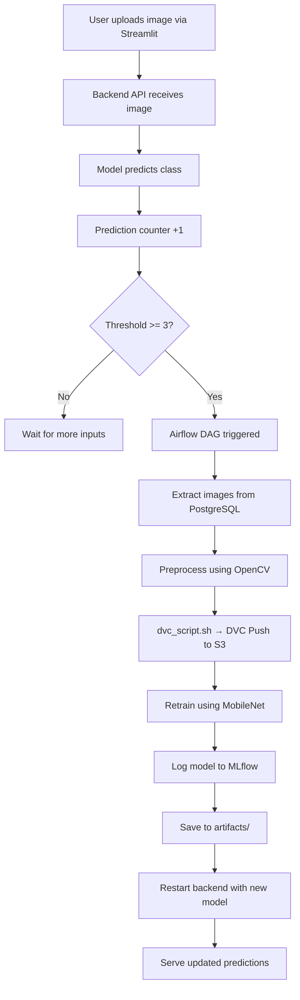

---

# 🧠📸 Rock-Paper-Scissors: Real-Time MLOps Pipeline with OpenCV, Airflow & Transfer Learning

Welcome to the **Rock-Paper-Scissors (RPS) MLOps System** — a cutting-edge, production-ready MLOps pipeline designed to process, predict, retrain, and redeploy machine learning models in real time. This solution brings together best-in-class tools like **OpenCV**, **MobileNet**, **Airflow**, **DVC**, **S3**, **Docker**, **Streamlit**, **PostgreSQL**, **Prometheus**, **Grafana**, and **CI/CD via GitHub Actions & EC2**.

---

## 🚀 Key Features

* 🧠 **Transfer Learning** with MobileNet for accurate RPS image classification
* 🎥 **Real-Time Inference** using OpenCV via live webcam
* 🔁 **Auto-Retrain Trigger** when prediction count exceeds threshold using Airflow
* ☁️ **DVC + S3** for robust **data versioning**
* 📦 **MLflow** for **model versioning**, **metrics logging**, and **artifact tracking**
* 🐳 **Containerized Microservices** using Docker Compose
* 🔐 **CI/CD** pipeline via GitHub Actions and EC2 integration
* 📊 **Prometheus + Grafana** for full-stack monitoring
* 🗃️ **PostgreSQL** for storing labeled image metadata

---

## 📁 Folder Structure & Purpose

```plaintext
.
├── .dvc/                          # DVC configuration and cache for data tracking
├── .github/workflows/            # CI/CD pipeline config (cicd.yml)
├── airflow/                      # Airflow DAG for retraining logic
│   └── scripts/
│       └── dvc_script.sh         # Script to push preprocessed data to S3 via DVC
├── artifacts/                    # Saved models, metrics, and intermediate outputs
├── Data/                         # Raw image data versioned via DVC
├── Database_connection/          # PostgreSQL init and mock data scripts
├── frontend/                     # Streamlit UI for uploading & predicting images
├── inference/                    # Model inference and image classification code
├── mlflow/                       # MLflow experiment setup
├── monitoring/                   # Prometheus & Grafana config
├── src/                          # Model training, preprocessing, logging
│   └── Dockerfile.src            # Dockerfile for training container
├── utils/                        # Common functions (e.g., OpenCV, metrics)
├── .env                          # Environment variables for AWS and DB
├── docker-compose.yml           # Compose for local full-stack development
├── docker-compose.build.yml     # Used by CI/CD to build and push Docker images
├── docker-compose.deploy.yml    # Compose file used for EC2 deployment
├── Dockerfile.backend           # FastAPI backend API Docker image
├── main.py                       # Backend API entry point
├── requirements.txt             # Python dependencies
```

---

## 🔁 System Workflow



---

## 🛠️ Airflow DAG - `rock_paper_scissors_retrain_pipeline`

**Trigger Condition**: Prediction count ≥ 3 (tracked in backend)
**Steps:**

1. 📤 `extract_images_from_postgres`: Pulls labeled image data from PostgreSQL
2. 🧼 `preprocess_images`: Applies resizing, normalization, and augmentation
3. 🧾 `dvc_script.sh`:

   * Path: `airflow/scripts/dvc_script.sh`
   * Role: **Pushes preprocessed dataset to remote DVC storage (S3)** for version control
4. 🤖 `retrain_rps_model`: Fine-tunes MobileNet, logs experiments to MLflow
5. 📦 `MLflow Tracking`: Stores trained model, accuracy, loss, and other artifacts
6. 🔁 Updated model is pulled and served by backend

---

## 🐳 Dockerized Microservices (Ports & Purpose)

| Service     | Port | Description                                |
| ----------- | ---- | ------------------------------------------ |
| PostgreSQL  | 5432 | Image label storage and metadata           |
| Airflow     | 8080 | DAG interface for retraining automation    |
| Backend API | 8000 | FastAPI for inference and DB communication |
| Streamlit   | 8501 | UI to upload images and get predictions    |
| Prometheus  | 9090 | Monitoring metrics collector               |
| Grafana     | 3000 | Visualization of metrics                   |
| MLflow      | 5000 | Model tracking interface                   |

🚨 **Note:** Only port `8501` (Streamlit frontend) is publicly exposed via EC2 for security.

---

## 📦 DVC for **Data Versioning** Only

* **Remote Storage:** `s3://anurag-dvc-eu-data`
* **Tracked Items:**

  * 📂 Raw and preprocessed image data
  * 📁 Cleaned image-label metadata
  * 📈 Training inputs for reproducibility

🧾 `airflow/scripts/dvc_script.sh` automates this process after preprocessing:

```bash
#!/bin/bash
dvc add Data/processed/
dvc push
```

---

## 📘 MLflow for **Model Versioning** & Experiment Tracking

* Logs:

  * 🧠 Model version & weights
  * 📉 Accuracy, loss, precision, recall
  * 📁 Artifacts (model.pkl, training logs, plots)
* Access via: `http://localhost:5000`
* Full experiment reproducibility

---

## 📈 Prometheus + Grafana Monitoring

📊 Visualized metrics:

* Request duration
* Prediction latency
* Model version in use
* CPU/Memory usage
* Endpoint hits (`/predict`, `/metrics`, `/upload`)

---

## 🔐 CI/CD with GitHub Actions & EC2

* **Trigger:** Push to `main` branch
* **Pipeline Includes:**

  * ✅ Set up Python, DVC, Docker
  * 📦 Pull dataset from S3 (via DVC)
  * 🐳 Build and push Docker images to DockerHub
  * 📤 Deploy updated stack to EC2 using SSH + Docker Compose

---

## 🧱 Production-Ready MLOps Architecture

This system follows **best practices in modern MLOps**, with:

| MLOps Phase        | Tool/Service Used                 |
| ------------------ | --------------------------------- |
| Inference          | OpenCV + FastAPI + Streamlit      |
| Monitoring         | Prometheus + Grafana              |
| Data Versioning    | DVC + S3                          |
| Model Versioning   | MLflow                            |
| Orchestration      | Airflow                           |
| Experiment Logging | MLflow                            |
| Continuous Deploy  | GitHub Actions + EC2 + Docker     |
| Microservices      | Docker Compose                    |
| CI/CD Secrets      | `.env` + GitHub Secrets + EC2 SSH |

---

## 🧱 Component & Interaction Overview

```mermaid
flowchart TD
    subgraph UserInteraction
        A[📸 Streamlit UI] --> B[🚀 Backend API (FastAPI)]
        B --> C[🧠 Model Prediction]
        B --> Counter[📊 Prediction Counter]
        Counter -->|>= 3| Airflow[🛠️ Airflow DAG Triggered]
    end

    subgraph AirflowPipeline
        Data[📂 Data Folder] --> Airflow[📡 Airflow DAG]
        Airflow --> Step1[📤 Extract from PostgreSQL]
        Step1 --> Step2[🧼 Preprocess Images]
        Step2 --> DVC_Script[📦 Run dvc_script.sh → Push to S3 via DVC]
        DVC_Script --> DVC[S3 Bucket (via DVC)]
        Step2 --> Step3[🤖 Retrain MobileNet Model]
        Step3 --> MLflow[🧾 Log to MLflow (metrics + artifacts)]
        Step3 --> Artifacts[📁 Save model to artifacts/]
    end

    subgraph Training
        Data --> src[⚙️ Training Scripts (src/)]
        src --> Artifacts
        Artifacts --> Backend[♻️ Backend Reloads Updated Model]
    end
```


---

## 👨‍💻 Connect With Me

* 💼 [LinkedIn](https://www.linkedin.com/in/anurag-raj-770b6524a/)
* 🧠 [Kaggle](https://www.kaggle.com/anuragraj03)
* 🐙 [GitHub](https://github.com/Anurag-raj03)
* 🐳 [DockerHub](https://hub.docker.com/u/anuragraj03)
* 📧 [anuragraj4483@gmail.com](mailto:anuragraj4483@gmail.com)

---

## 📌 Summary

> This project demonstrates a **scalable, production-grade MLOps pipeline** by integrating the **complete lifecycle of a deep learning model**, including:

✅ Real-time prediction
✅ Automated data and model versioning
✅ Scheduled and conditional retraining
✅ Dockerized, modular architecture
✅ Full observability via Prometheus + Grafana
✅ Reliable CI/CD with minimal human intervention
✅ Streamlit-based UI with FastAPI-powered backend

⚙️ *It’s not just a project — it’s a blueprint for building real-world, deployable MLOps systems.*


